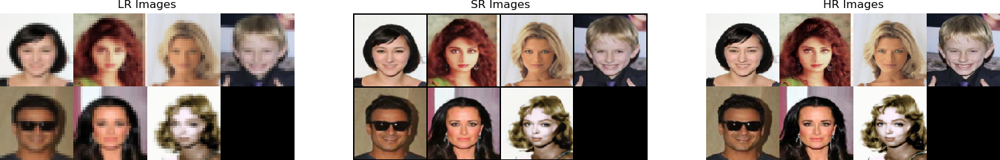

# Single-Image-Super-Resolution

Repo du stage d'été de M1 (2018-2019) dans l'équipe MLIA (encadrant Patrick Gallinari)

## Carnet de bord
  - semaine du 27/05 (début du stage de Keyvan)
    - Lecture d'articles de recherche (GAN, GAN conditionnel, SRGAN, Amortized MAP Inference for image SR)
    - Téléchargement de celebA
    - Tuto DCGAN pytorch
    
  - semaine du 03/06
    - Implémentation de SRGAN
      - adverserial loss: Generator et Disciminator customisables
      - content loss via MaskedVGG (concaténation de VGG22, VG54, ...)
      - initialisation par défaut de PyTorch, on peut utiliser une MSE pendant 1 epoch comme initialisation
      
    - Exécution du code sur GPU
    - Sauvegarde des réseaux entraînés
    - Lecture de AmbientGAN et de l'article d'Emmanuel
    - téléchargement de MNIST (base de données plus simple pour les modèles). Pas pratique au final car images trop petites (et un seul channel)
  
  - 10/06
    - Début de prise en main du [framework d'Emmanuel (privé)](https://github.com/emited/tmd_framework) qui se sert de:
      - [Ignite](https://pytorch.org/ignite/) (pour ne pas avoir à écrire la boucle d'entraînement et logger les résultats)
      - [Sacred](https://sacred.readthedocs.io/en/latest/index.html) (pour sauvegarder les configs utilisées) 
  
  - 17/06
    - Présentation du modèle de super résolution d'Emmanuel (qui se base sur AmbientGAN)
    - Implémentation du modèle en partant de notre code du SRGAN
    - Début d'implémentations de SRGAN et du modèle d'Emmanuel sur le framework d'Emmanuel
  
  - 24/06
    - Téléchargement et entraînement sur la base de données flickr8k
    - Implémentation de SRGAN sur le framework d'Emmanuel
    - Tentatives (infructueuses) d'entraînement du réseau en x16:
      - La loss D est toujours très faible
      - La loss G augmente parfois énormément puis stagne pendant une centaine d'itérations puis redescent
    - Lecture d'articles et tutos sur les améliorations que l'on peut d'implémenter sur notre réseau 
  
  - 01/07
    - Améliorations pour entraînement x16:
      - Initialisation de G en utilisant seulement une MSE pendant une epoch,
        puis entraînement du discriminateur uniquement (moins d'une epoch pour éviter le sur-apprentissage)
      - real_label = .9 (au lieu de 1) pour que D ne soit pas sûr de lui
      - Sauvegarde des anciennes images générées pour réentrainer D dessus
      - Normalisation des gradients à 1
    - En partant d'un mếme réseau, deux entraînement donnent des images complètement différentes,
      on peut mettre torch.backends.cudnn.deterministic = True et torch.backends.cudnn.benchmark = False
    - todo: en calculant lr en interpolant hr, on dépasse un peu de [-1, 1]
  
  
## todo
  - améliorations potentielles pour l'implémentation de SRGAN (résultats déjà excellents)
    - poids de la content loss
    - lr_decay
    - télécharger la même base de données que dans l'article pour pouvoir comparer
    - ajouter des tests
    
  